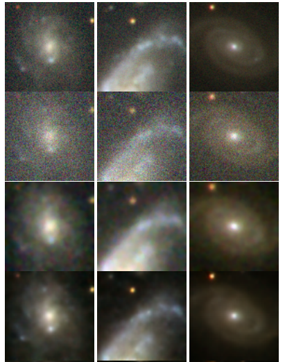

 <b>  GAN network galaxy probe </b> 

My first machine learning project, inspitrated by  <a href='https://academic.oup.com/mnrasl/article/467/1/L110/2931732'>GalaxyGAN </a>. 
  

 In the present era of astronomy, we are expecting a large amount of data
that can not be fully processed by humans. Because of this, it is convenient
to develop a method that analyzes the data efficiently and reliable. Our
work reacts to the current situation and it is inspired by the GalaxyGAN
project we have been exploring the use of neural networks in the processing
of astronomical images. Observation of astronomical objects is limited by
many factors and one of them is noise. Our research has focused on the removal of noise through generative adversarial networks (GANs). The results
have shown that neural networks can be used for a given problem, and in
comparison with available methods, the results comparable and sometimes
even better. 

